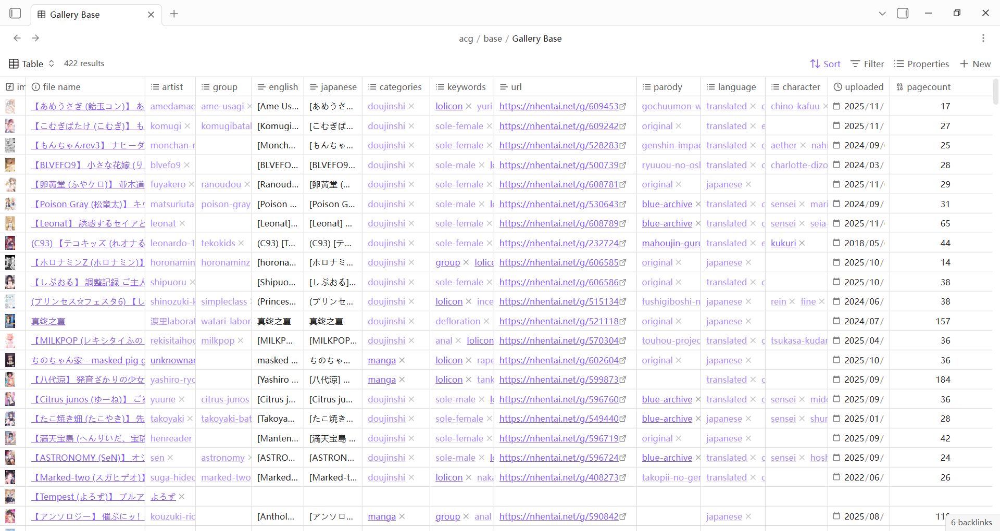
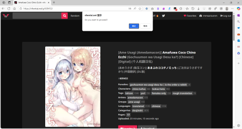
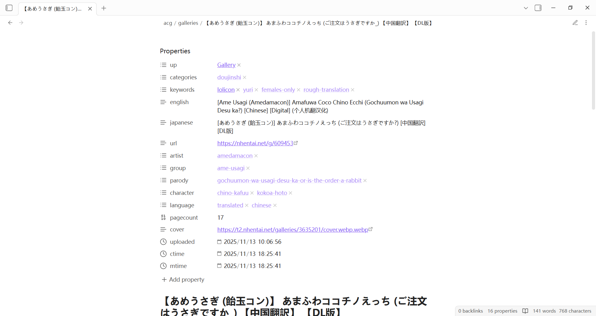
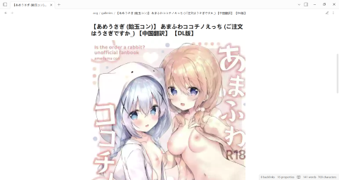
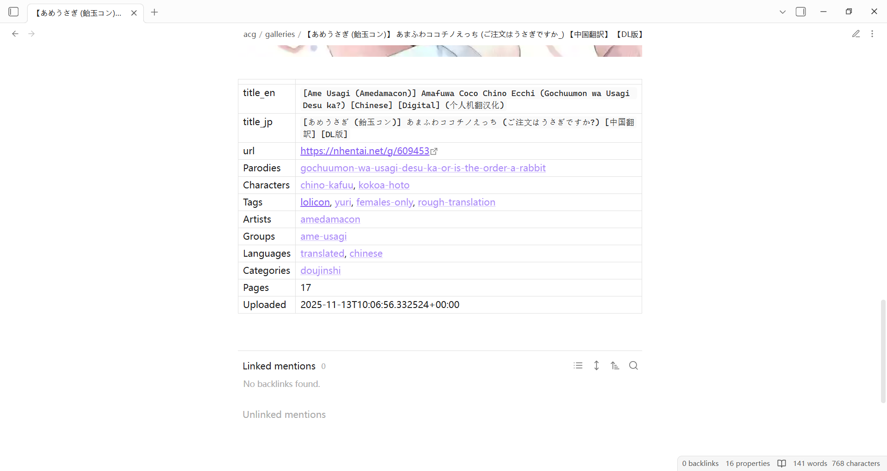

# nhentai-web-clipper-for-obsidian

🔞 A user script that exports NHentai gallery metadata as Obsidian Markdown files (Obsidian NHentai Web Clipper).

A generated markdown note example is shown below

```markdown
---
up:
  - "[[Gallery]]"
categories:
  - "[[doujinshi]]"
keywords:
  - "[[lolicon]]"
  - "[[yuri]]"
  - "[[females-only]]"
  - "[[rough-translation]]"
english: "[Ame Usagi (Amedamacon)] Amafuwa Coco Chino Ecchi (Gochuumon wa Usagi Desu ka?) [Chinese] [Digital] (个人机翻汉化)"
japanese: "[あめうさぎ (飴玉コン)] あまふわココチノえっち (ご注文はうさぎですか?) [中国翻訳] [DL版]"
url: https://nhentai.net/g/609453
artist:
  - "[[amedamacon]]"
group:
  - "[[ame-usagi]]"
parody:
  - "[[gochuumon-wa-usagi-desu-ka-or-is-the-order-a-rabbit]]"
character:
  - "[[chino-kafuu]]"
  - "[[kokoa-hoto]]"
language:
  - "[[translated]]"
  - "[[chinese]]"
pagecount: 17
cover: https://t2.nhentai.net/galleries/3635201/cover.webp.webp
uploaded: 2025-11-13T10:06:56.332524+00:00
ctime: 2025-11-13T18:25:41+08:00
mtime: 2025-11-13T18:25:41+08:00
---

# 【あめうさぎ (飴玉コン)】 あまふわココチノえっち (ご注文はうさぎですか_) 【中国翻訳】 【DL版】


| | |
| --- | --- |
| title_en | `[Ame Usagi (Amedamacon)] Amafuwa Coco Chino Ecchi (Gochuumon wa Usagi Desu ka?) [Chinese] [Digital] (个人机翻汉化)` |
| title_jp | `[あめうさぎ (飴玉コン)] あまふわココチノえっち (ご注文はうさぎですか?) [中国翻訳] [DL版]` |
| url | https://nhentai.net/g/609453 |
| Parodies | [[gochuumon-wa-usagi-desu-ka-or-is-the-order-a-rabbit]] |
| Characters | [[chino-kafuu]], [[kokoa-hoto]] |
| Tags | [[lolicon]], [[yuri]], [[females-only]], [[rough-translation]] |
| Artists | [[amedamacon]] |
| Groups | [[ame-usagi]] |
| Languages | [[translated]], [[chinese]] |
| Categories | [[doujinshi]] |
| Pages | 17 |
| Uploaded | 2025-11-13T10:06:56.332524+00:00 |
```

## How to use

First, install this user script.

Then, when you navigate to the URL https://nhentai.net/g/*, click the "OK" button in the pop-up dialog box to save the current gallery's metadata as an Obsidian Markdown note file.

Additionally, you can download all image files linked to by external image links in the note file using the Obsidian command "Download attachments for current file".

## Screenshots

### 1. The example table view in the Obsidian vault

 

### 2. The example use case

 

### 3. The example generated markdown note file

 
 
